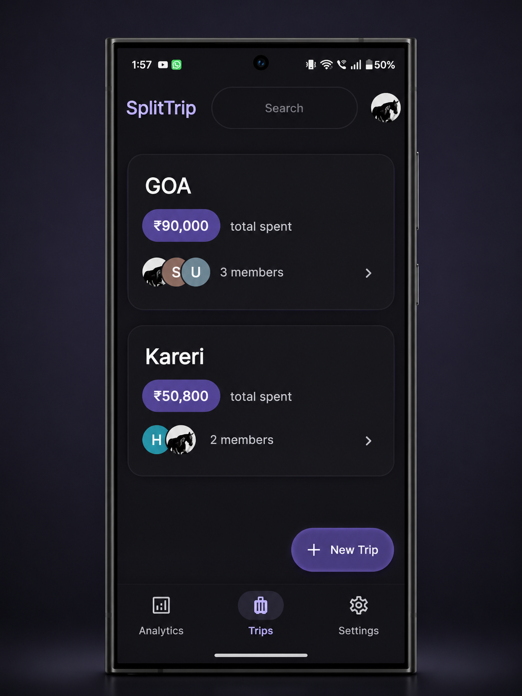
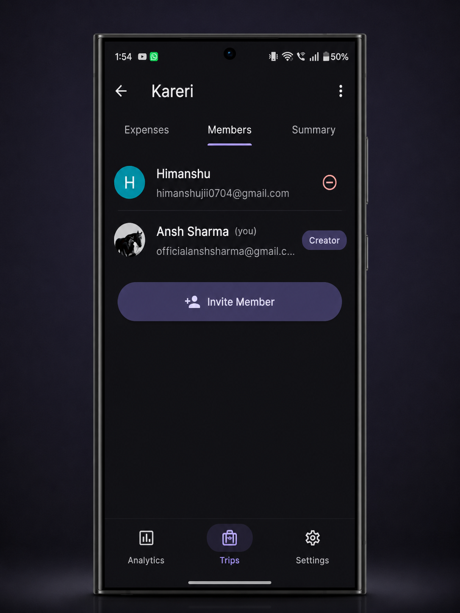
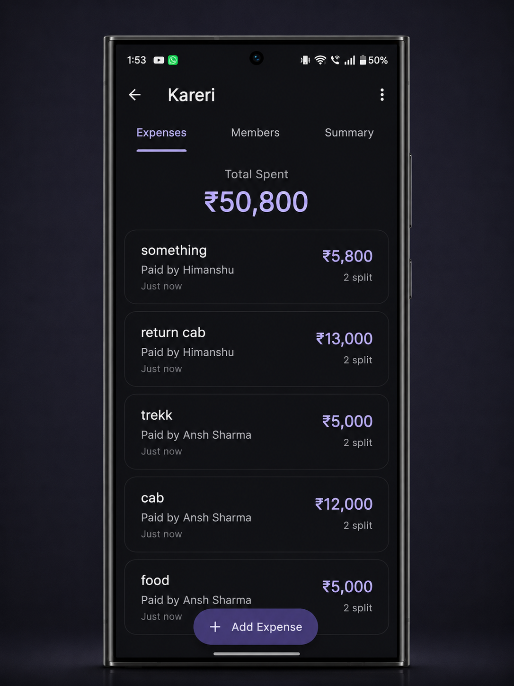
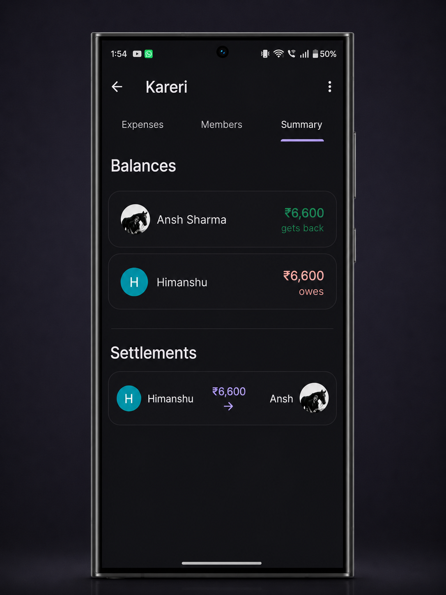
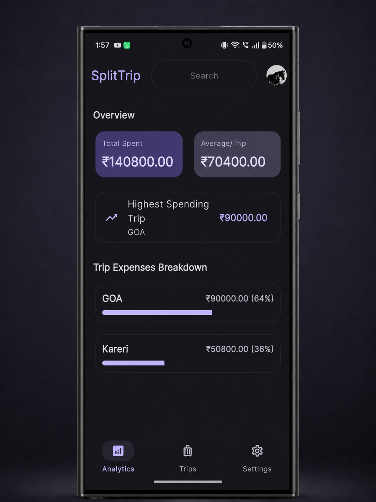
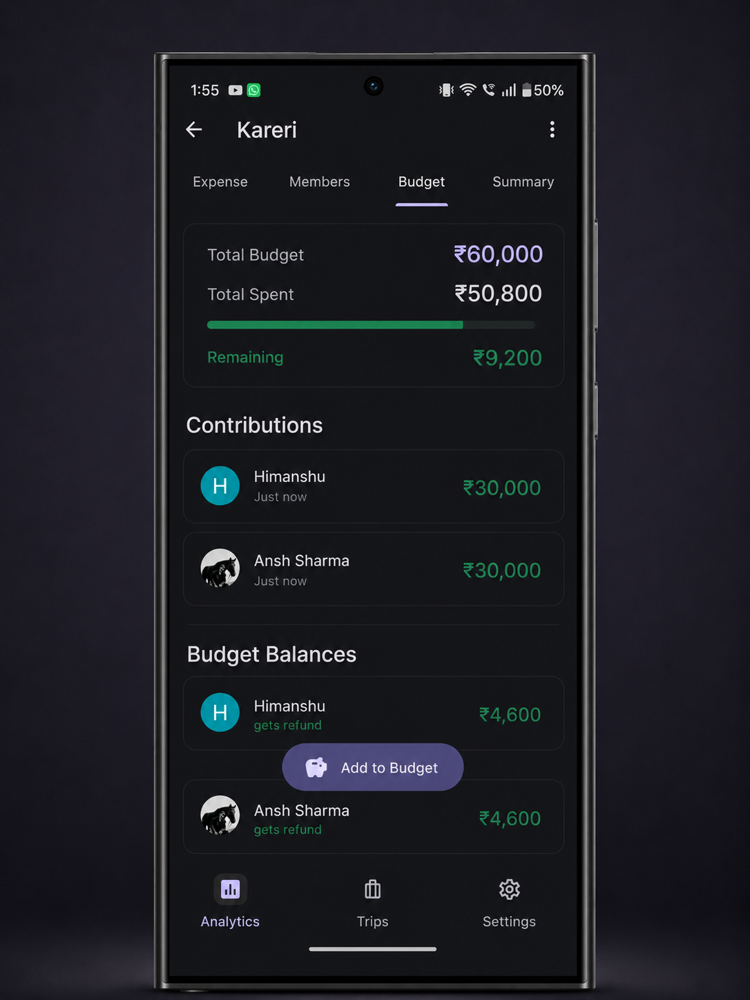
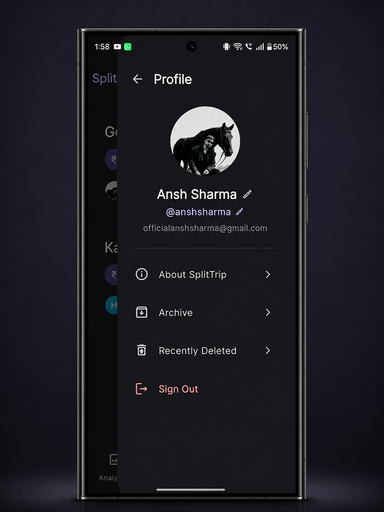
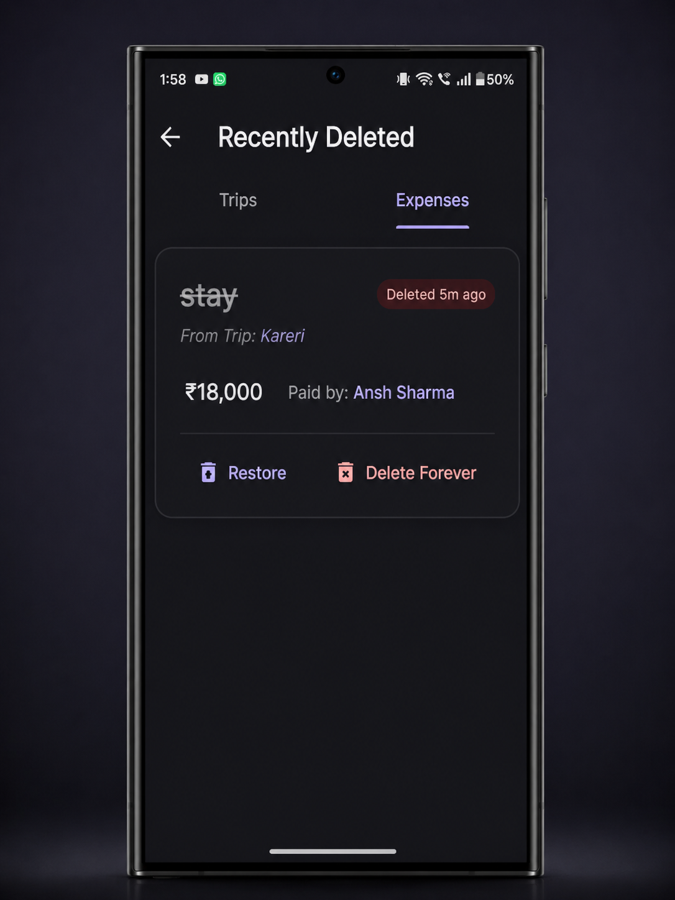
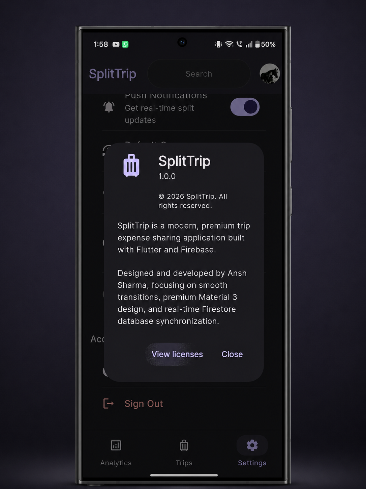

<h1>SplitTrip</h1>

<strong>Split travel expenses. Settle debts. Stay in sync.</strong>

  
  &nbsp;
  

  
  &nbsp;
  
  &nbsp;
  
  &nbsp;
  

---

### No more IOUs. No more awkward "you owe me" conversations.
SplitTrip automatically figures out who owes who — and the smartest way to settle up.

---

## Table of Contents

- [Screenshots](#-screenshots)
- [Features](#-what-splittrip-does)
- [Get Started](#-get-started)
- [How It Works](#️-how-it-works)
- [Privacy & Security](#-privacy--security)
- [Changelog](#-changelog)
- [Found a Bug?](#-found-a-bug)

---

## 📱 Screenshots

> Click any screenshot to view it full size.

### Home & Group Trips

| Home | Members | Expenses |
|:---:|:---:|:---:|
|  |  |  |

### Finance, Budget & Analytics

| Summary & Balances | Analytics | Budget Tracker |
|:---:|:---:|:---:|
|  |  |  |

### Profile & More

| Profile | Recently Deleted | About |
|:---:|:---:|:---:|
|  |  |  |

---

## ✨ What SplitTrip Does

### 💸 Track Every Expense Instantly
Add an expense in seconds — who paid, how much, and who it's split between. SplitTrip does the math automatically and updates everyone's balance in real time.

### 🧠 Smart Auto-Settlement
Forget the spreadsheet. SplitTrip calculates the **minimum number of payments** needed to settle all debts in the group — so instead of 10 confusing transfers, you might need just 3.

### 📊 See the Full Picture
Get a clear breakdown of who owes what, how spending is distributed across the group, and where your money is going — all in one glance.

### 🎯 Set & Track a Budget
Define a trip budget, assign contributions per member, and watch the tracker fill up as expenses are added. Over-budget alerts keep the group on track.

### 🔄 Real-Time Sync
Every expense, every settlement, every change — synced instantly across all devices the moment it happens. No refreshing, no waiting.

### 🗑️ Soft Delete with Undo
Accidentally deleted an expense? SplitTrip moves it to **Recently Deleted** where you can restore it any time. Nothing is gone forever unless you choose it to be.

### 🔔 Push Notifications
Get notified when a trip member adds an expense or settles a debt — even when the app is closed.

---

## 🚀 Get Started

### 📦 Android APK

1. Go to the [**Releases**](../../releases/latest) page
2. Download the latest `splittrip.apk`
3. Open the file on your device to install

> ⚠️ You may need to enable **Install from unknown sources** in Android Settings → Security.

### 🍏 iOS (iPhone) PWA

1. Open **[splittrip.ansh.one](https://splittrip.ansh.one)** in **Safari**.
2. Tap the **Share** button (the square icon with an upward arrow) in the browser toolbar.
3. Scroll down and tap **Add to Home Screen**.
4. Tap **Add** in the top-right corner to install the app on your home screen.

### 🌐 Web — Instant, No Install Required

Open **[splittrip.ansh.one](https://splittrip.ansh.one)** in any browser.

---

## 🔐 Privacy & Security

| | |
|:---|:---|
| 🔑 **Authentication** | Google Sign-In only — no passwords ever stored |
| 🗄️ **Data Storage** | Secured in Firebase Firestore with strict access rules |
| 🔒 **Access Control** | Only trip members can view or modify trip data |
| 🚫 **No Tracking** | Zero ads, zero analytics, zero third-party data sharing |

---

## 🗺️ How It Works

| Step | Action |
|:---:|:---|
| **1** | Create a trip and give it a name & budget |
| **2** | Invite friends — they join instantly with your trip code |
| **3** | Log expenses — who paid, how much, who it's split between |
| **4** | Check live balances — see exactly who owes who |
| **5** | Settle up — record payments to clear all debts |

---

## 📋 Changelog

### [v1.0.0](../../releases/tag/v1.0.0) — Initial Release

- ✅ Core expense tracking with real-time Firebase sync
- ✅ Smart auto-settlement engine (minimum transactions)
- ✅ Budget tracking with per-member contributions
- ✅ Google Sign-In authentication
- ✅ Push notifications via Firebase Cloud Messaging
- ✅ Archive & Recently Deleted screens with restore
- ✅ Material 3 design with full dark mode support
- ✅ Progressive Web App (PWA) with offline caching & auto-updates

---

## 🐛 Found a Bug?

[**Open an issue →**](../../issues/new)

Please include:
- Your device model & Android/browser version
- Step-by-step reproduction steps
- What you expected to happen vs. what actually happened

---

**Built with [Flutter](https://flutter.dev) & [Firebase](https://firebase.google.com)**

Made with ❤️ by **Ansh Sharma**

